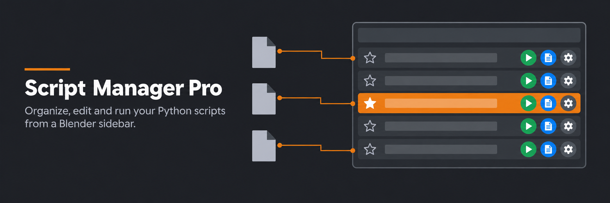
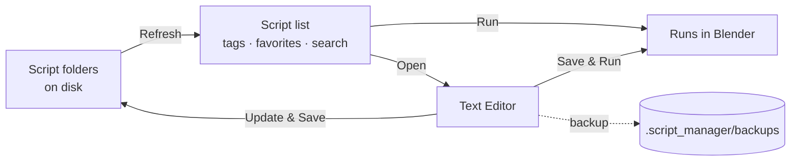

<p align="center">
  
</p>

<p align="center">
  
  
  
  
</p>

<p align="center">
  Keep your Python scripts as plain <code>.py</code> files on disk.<br>
  Run them, edit them and save them back, all from a sidebar in Blender.
</p>

<!-- GIF 1: Hero. 3D Viewport sidebar, click Play on a script, it runs. 5-8 sec. -->
<p align="center">
  
</p>

---

## Features

| Feature | What it does |
|---------|--------------|
| **One-click run** | Run any script from the sidebar in the 3D Viewport or the Text Editor |
| **Edit & save back** | Open a script in the Text Editor, edit it, and write it back to the `.py` file with **Update & Save** or **Save & Run** |
| **Automatic backups** | Every save keeps a copy of the previous version (on by default) |
| **Multiple folders** | Add as many library folders as you want. Subfolders are scanned too |
| **Tags & favorites** | Group scripts with comma separated tags, star the ones you use most |
| **Search** | Separate search fields for folders, tags and scripts |
| **Portable metadata** | Tags, favorites and names live next to your scripts in `.script_manager/metadata.json` |
| **Safe by design** | Runs files with Blender's own `script.python_file_run`. No `exec()`, no `eval()`, no scanning on startup |

## Workflow



## Installation

1. Download the latest `.zip` from [Releases](../../releases).
2. In Blender: **Edit ▸ Preferences ▸ Get Extensions ▸ ⌄ ▸ Install from Disk…**
3. Pick the `.zip`, then enable **Script Manager Pro**.

## Setup

1. Press `N` in the 3D Viewport and open the **Script Manager** tab.
2. Click **Add Folder** and point it to a folder with your `.py` scripts.
3. Press **Refresh**. Done.

<!-- GIF 2: Setup. Add Folder, pick a path, press Refresh, list fills up. -->
<p align="center">
  
</p>

## Usage

### Run scripts

Every row in the **Scripts** list has four buttons:

| Button | Action |
|--------|--------|
| Star | Toggle favorite |
| Play | Run the script from disk |
| Text | Open in Text Editor |
| Gear | Script settings: display name and tags |

### Edit scripts in the Text Editor

**Open in Text Editor** reuses an existing Text Editor or splits the current area to create one. The sidebar there gets an extra box for the open file:

| Button | Action |
|--------|--------|
| **Update & Save** | Write your edits back to the `.py` file on disk |
| **Save & Run** | Save, then run the file |
| **Reload from Disk** | Discard edits and reload the file |
| **Close** | Remove the text block from the `.blend`, the file on disk is kept |
| **Save as .py…** | Save a brand new text into a script folder and add it to the library |

<!-- GIF 3: Edit workflow. Open in Text Editor, change a line, Update & Save, then Play. 10-15 sec. Most important GIF. -->
<p align="center">
  
</p>

### Tags & favorites

- Open a script's **settings (gear icon)** and type tags separated by commas, e.g. `rigging, utils`.
- Or press **+** in the **Tags** panel to create an empty tag first.
- Click a tag to filter the list. Double-click a tag to rename it everywhere.
- **Favorites** and **Untagged** are always available as quick filters.

<!-- GIF 4: Tags. Open settings, add tags, click tag in Tags panel to filter, star a favorite, switch to Favorites. -->
<p align="center">
  
</p>

### Multiple folders

With more than one folder configured, a **Folders** panel appears. Pick a folder to limit the Tags and Scripts lists to that library, or **All** to see everything.

<!-- GIF 5 (optional): Folders. Switch between folders, counts update. -->
<p align="center">
  
</p>

## Preferences

**Edit ▸ Preferences ▸ Add-ons ▸ Script Manager Pro**

| Setting | Description |
|---------|-------------|
| **Script Folders** | Library folders, scanned recursively on Refresh |
| **Backup on Save** | Keep a copy of the old file before **Update & Save** overwrites it |
| **Keep Backups** | How many backups to keep per script (default 10) |

Backups are stored in `<folder>/.script_manager/backups/`.

## What goes where

```
my_scripts/                     ← a library folder you added
├── cleanup_scene.py
├── rig_helpers/
│   └── mirror_bones.py         ← subfolders are scanned too
└── .script_manager/            ← created by the add-on
    ├── metadata.json           ← tags, favorites, display names
    └── backups/                ← previous versions of saved scripts
```

## Permissions

| Permission | Reason |
|------------|--------|
| `files` | Read, run and save scripts in the selected library folders |

## License

[GPL-3.0-or-later](https://www.gnu.org/licenses/gpl-3.0.html)

<p align="center">
  Made by <a href="https://github.com/cemilbnr"><b>Cemil Berk</b></a>
</p>
